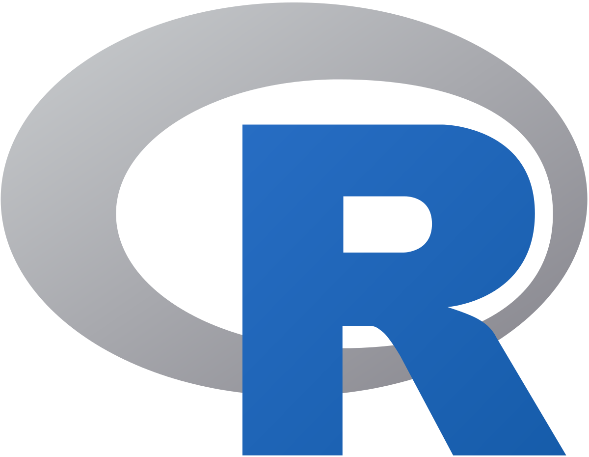
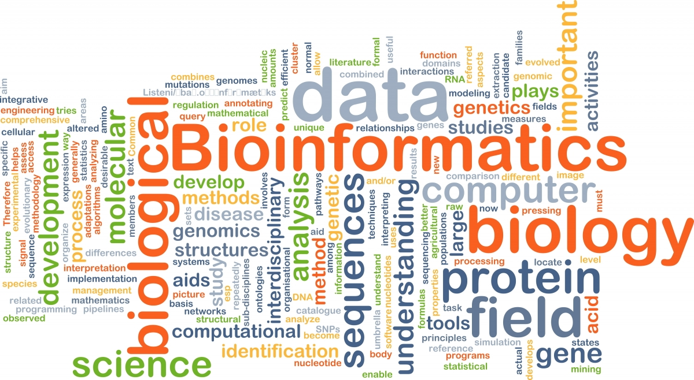

----

# R and RStudio

----

**Instructor:** Owen Bevis, Melea Barahona, Carol Wilusz 
**Material Provided by:** Erin Osborne Nishimura Ph.D.

**Dates:** Monday April 6, 2026 & Wednesday April 8, 2026

## R & R Studio Module

We will explore the basics of **R**. What is R? 
  * R is a programming language, a coding environment, and a whole community. 
  * The goal of this module is __not__ to master R. That will take time. 
  * Here, we will just get to know a few basics of interfacing with and using R. 
  * Many people in this class are already familiar with R. There will be additional content for you. 

## Introductions
  * Owen's background & journey. How did I get here?
  * Melea's background & journey. How did I get here?

## Learning objectives for this module

  1. Students will describe the differences between R and Python **Carol/Melea**
  3. Students will learn about R: it's **history** and how it is **useful in biological research**
  4. Students will learn how to **interface** with R and RStudio including using Github for version control.
  5. Students will become familiar with a few basic **R objects** (or extend their knowledge into new objects)
  6. Students will execute a few basic **R functions** (or extend their knowledge into new functions)
  
## Next:
  * Students will learn to **import and export** data
  * Students will learn to extend functionality of R by loading **packages**
  * Students will gain experience in basic **plotting**

-----
  
Continue on to [R Basics](02_R_Basics.md)

